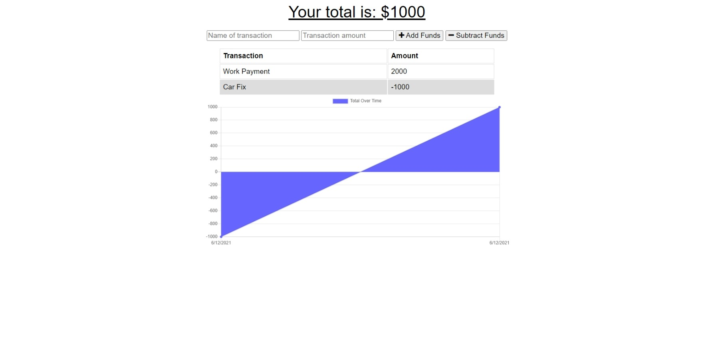

# budget_tracker

#### Table of Contents
* [About](#about-this-project)
    * [Description](#description)
* [Usage](#usage)
* [Contributors](#contributors)

# About this Project

## Description

I built the service-worker and db.js for this app to give it offline functionality. When the user goes offline they can still use the web app, and once they reconnect, their data will populate the API. 

# Usage

Click the link to our webpage: <https://enigmatic-escarpment-66602.herokuapp.com/>

# Contributors

* [Samuel Oberg](https://github.com/sosoberg)